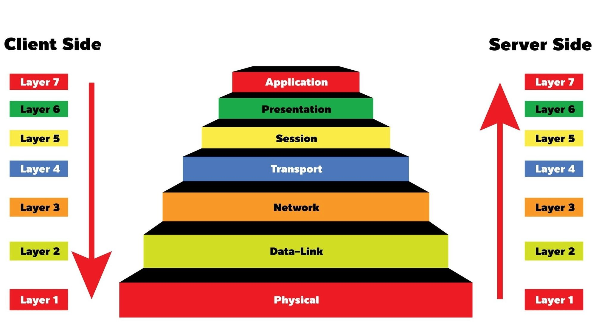

# Network

### Agenda :
1. what is a Host ?
2. what is a server ?
3. what is a network ?
4. what is the OSI model ?
5. what are the first 4 layers of the OSI model
    - physical layer 
    - Data link  
    - Network 
    - Transport


## what is a host ? :computer:

**Host** : are any device that receives of sends traffic

 **We will talk about hosts in two diffrent forms:**

- server
- client

## what is a server ? 

**Server** : It's is a host that has the proprer software to respond to a specific request.

**Should the server always have gigantic resources ?**

## what is a network ?

**Network** : it is the connection between hosts by whitch the traffic (data) is transfered from one host to another and to allow one host to use the resources of the other.

## What is the OSI model ?



**OSI MODEL** : it is a model of the way the network works and transfere data between hosts and it's devided into 7 layers as in the image above 

in the coming part we will discuss the first four layers of the OSI model and their functions and how do they serve the transferring of data between hosts

## what are the first 4 layers of the OSI model ?

### first : the physical layer 🔌

this layer is resposible for the physical connetions between the hosts and it's core functionallity is to transfere bits of data(0, 1).

examples : wires, Wi-Fi, devices like (Hubs, Bridges,Routers, repeaters, ...)

in summary we can say that this layer represents the infrastructure for the network


### second : Data Link <sub>(Hop-to-Hop)</sub> 
this second layer interact with the elements of the first layer with some devices like (NIC : Network Interface Card , Wi-Fi access cards, switches(both first and second)) using what is called a MAC adress

which consists of 48 bits devided into 12 hex digits in groups of two like the picture shown above

**<center>00:1A:3F:F1:4C:C6</center>**

this MAC adress is unique for every NIC for the hosts, even routers has NIC with a MAC adress so it helps the data to rich the desired host within a network under one condition
***the sender and the receiver must be directly connected***

packet + MAC = Frame

### third : Network <sub>(End-to-End)</sub>

this layer is resposible for transfering the data to the end receiver **even if they are not directly connected**

the devices used in this layer are Routers and the hosts themselves which can be said as any thing that has an **IP address** 
**<u>but what is an IP adress :- </u>**

IP (internet protocol) address is an address that is unique for every host in a specific network

note:Routers may have more than one IP addresses at once because they might be connected to more than one netwrok at once

there are two version of IP adresses 


with the limitation of the number that ipv4 can handle the ipv6 was developed

| Tables   |      IPv4      |  IPv6 |
|----------| ------------- |------|
| Address Size | 32-bit (4.3 billion IPs) | 	128-bit (340 undecillion (340 * 10<sup>36</sup>) IPs) |
| Format | Decimal (e.g., 192.168.1.1)  | Hexadecimal (e.g., 2001:db8::1)|
| Security | No built-in encryption	 | Built-in IPSec for security |
| Efficiency | Simple, but limited	| Optimized for modern networks |
| Address Length	| Shorter | Longer |


segment + IP = packet

### fourth : Transport <sub>(service-to-service)</sub>

this layer is resposible for delevering the data to the right service by delevering it to the right port

A port: can be looked at as a part of your system that is specified to a certain task or to run a certain service

so when the data arrives the host the data must go to the targeted port.

there are two protocols that help in this process (UDP:user datagram protoco/TCP:transmission control protocol) those are protocols that help to assign the port to the packet and to direct the packet to the specified service in the port 

data + TCP/UDP = segment

## HTTP protocol :-

### <pre> What is the http protocol ? :</pre> 

- Hypertext Transfer Protocol: A stateless, application-layer protocol used for transferring data over the web.

### <pre> Is there one method for handling data using http ? :</pre>

- GET
- POST
- PUT
- DELETE
- PATCH

#### are those the only ones ? , No actually there are a bunch

#### but the ones written above are the most used so we will focus more on those :)

### How does the request look like ?


### How does the server respond to the request ?

##### I am so sorry to tell you but ....
## THIS IS YOUR JOB !!!

### How does a response look like ? 


- **Response:** Status codes (e.g., 200 OK, 404 Not Found, 500 Internal Server Error), Headers, Body.


Unauthrized(not even authenticated) VS Forbidden(Authenticated but not authrized)
. **HTTP Headers**
    - Common headers: Content-Type, Authorization, Cache-Control, etc.
    
. **HTTP VS HTTPS:**
    - Secure communication with SSL/TLS.
. **Cookies and Sessions**
    - State management and authentication.


## How can we access websites ?

### <u>DNS server</u> :-

#### So HOW does it work ? , what does it do ?


- DNS stands for Domain Name System 
- It maps the domain names to IP adresses in order for our computer to send and receive information from the website corresponding to this domain
<br><br>

- **DNS Lookup Process:**
    - Browser → Operating System →
     Stub Resolver(check cache) → Recursive Resolver(check cache)
      → Root Server(for TLD list of servers)
      → TLD Server(for authortative list of servers (SLDs)) 
      → Authoritative Name Server.
- **Caching:**
    - Role of DNS caching in speeding up requests by storing the frequently visited IPs for a faster lookup

#### Does it just return the IP Adress ?
***DNS returns what is known as a zone file which contains alot of Data about the visited site like***
- **DNS Records:**
    - `A`
      - Purpose: Maps a domain name.
      - Example:
        `example.com   A   192.168.1.1`

      - Usage: Directs traffic to a server's IPv4 address.
    - `AAAA`
      - Purpose: Maps a domain name to an IPv6 address.
      - Example:
        `example.com   AAAA   2001:0db8:85a3::8a2e:0370:7334`

      - Usage: Directs traffic to a server's IPv6 address.
    - `CNAME`
      - Purpose: Aliases one domain name to another.
      - Example:
        `www.example.com   CNAME   example.com`

      - Usage: Allows `www.example.com` to point to `example.com` without duplicating A or AAAA records.
    - `MX`
      - Purpose: Specifies the mail servers responsible for receiving emails for a domain.
      - Example:
        `example.com   MX   10 mail.example.com`
        - Priority: Lower numbers have higher priority (e.g., `10` is higher priority than `20`).
      - Usage: Routes emails to the correct mail server.
    - `TXT`(for admin notes and email security)
    - `NS` (authertative servers for the domain name)
    - `SOA`
    - `PTR`(reverse of DNS for security reasons)
    - `SRV`
    - `ALIAS or ANAME Record`
 **Common DNS Issues:**
    - DNS propagation delays, misconfigurations.

## APIs (Application Programming Interfaces)

Discuss how backend systems communicate using APIs:

1. What is an API?
    - Interface for communication between software components.
1. Types of APIs:
    - `REST` (most common) 
    - `GraphQL`
    - `SOAP`
    - `gRPC.`
1. **RESTful APIs:**
    - **Principles:** 
      - **Stateless:** means that **calls can be made independently of one anther**
      - **CRUD Operations:** Create, Read, Update, Delete.
      - Via **HTTP protocol**
    - `JSON` and `XML` formats.
    
1. **Authentication in APIs:**
    - `API keys`, `OAuth2`, `JWT`.
1. **API Documentation:**
    - It is important to document what every API does
    - tools to use `Swagger`, `Postman`,`Thunder clint` 

## APIs (Application Programming Interfaces)

Discuss how backend systems communicate using APIs:

1. What is an API?
    - Interface for communication between software components.
1. Types of APIs:
    - `REST` (most common) 
    - `GraphQL`
    - `SOAP`
    - `gRPC.`
1. **RESTful APIs:**
    - **Principles:** 
      - **Stateless:** means that **calls can be made independently of one anther**
      - **CRUD Operations:** Create, Read, Update, Delete.
      - Via **HTTP protocol**
    - `JSON` and `XML` formats.
1. **Authentication in APIs:**
    - `API keys`, `OAuth2`, `JWT`.
1. **API Documentation:**
    - Importance of clear docs and tools like `Swagger`, `Postman`,`Thunder clint` .

---
## what is a framework ? 
<br><br>

### framework vs library

the key difference is the inversion of control 
- Our code can call some functions modules from the library to acccompish a task or implement a protocol or whatever but we are in control of what and when to call from a library

- It's a bit different with the framework
in the framework the frameworke call our code it's like an abstract class that you implement it's abstract function, so it's like a skeleton that you fill with your own custom code to serve the purpose that you want 


#### in our case we will be using ExpressJS as our framework with alot of other libraries

#### some differences between the two
| **S.No** | **Framework** | **Library** |
|:--------:|---------------|-------------|
| 1. | It comprises of a lot of APIs, compilers, support programs, libraries etc. | It is a collection of helper modules, classes, objects, functions, pre-written code, etc. |
| 2. | It is difficult to replace frameworks. | A library is easy to be replaced with another library. |
| 3. | A framework development requires a lot of code that decreases performance and increases the load time. | Building a library requires less code, so there is better performance and fast load time. |
| 4. | Including a framework smoothly into an existing project is impossible. | Libraries can be integrated easily into existing projects to add specific functionality. |
| 5. | Its examples are AngularJS, Spring, NodeJS, etc. | Its examples are JQuery, React JS, etc. |

## what is a Runtime enviroment ? 
<br>

- Runtime environments (RTE for short) act as small operating systems and provide all the functionality necessary for a program to run. This includes interfaces to physical parts of the hardware, user interactions, and software components.

- An application that’s currently running interacts with the runtime environment via a runtime system. The runtime environment in turn acts as a go-between between the application and the operating system. As soon as a program is executed, it sends instructions to the computer’s processor and RAM, and accesses system resources. The runtime environment thus includes hardware, memory, variables in the environment, and interactions with the user and software components.


#### in our case we will be using NodeJs to run JavaScript code in our IDE/Terminal  

## Express NodeJS - First API call

To establish a server using **Node.js**, you can use either the built-in http module or Express.js (which simplifies the process). Below are two methods:

  - Method 1 (Using Node.JS direct): 
  ``` js
    const http = require('http');

    // Create a server
    const server = http.createServer();

    // Listen on a port
    const PORT = 3000;
    server.listen(PORT, () => {
        console.log(`Server running on http://localhost:${PORT}`);
    });
  ```
  - Method 2 (Using Express Node.JS)
  ```js
    const express = require('express');
    const app = express();

    // Listen on a port
    const PORT = 3000;
    app.listen(PORT, () => {
        console.log(`Server running on http://localhost:${PORT}`);
    });
  ```
---

## API Testing:
  - Postman [Website](https://www.postman.com/) - [Extension](https://marketplace.visualstudio.com/items?itemName=Postman.postman-for-vscode)
  - Thunder Clint [Website](https://www.thunderclient.com/) - [Extension](https://marketplace.visualstudio.com/items?itemName=rangav.vscode-thunder-client)

## Task
1. Publish a server using Node.Js direct.
2. Publish a server using Express.Node.Js. 
3. Access the server though your phone and send a screeshot. 
4. Only run [meefr-quiz-game](https://www.npmjs.com/package/meefr-quiz-game) test - follow the steps mentioned in readme file.


additional resources 
----------------------
<pre>
port : <a href = "http://techtarget.com/searchnetworking/definition/port#:~:text=A%20port%20in%20computer%20networking,is%20a%2016-bit%20number.">techtarget.com</a> (essay about the ports)

MAC adress : <a href = "https://tecadmin.net/media-access-control-address">tecadmin.net</a> (MAC adress details)

IP :   <a href ="https://www.geeksforgeeks.org/differences-between-ipv4-and-ipv6/" >geeksforgeeks.org</a> (about what an IP is )

IPv6 format: <a href ="https://www.ibm.com/docs/en/i/7.3.0?topic=concepts-ipv6-address-formats">IBM.com</a> (IPv6 format)

Networks fundmentals : <a href ="https://youtube.com/playlist?list=PLIFyRwBY_4bRLmKfP1KnZA6rZbRHtxmXi&si=H5Bz9TQyxoUqfB8D">youtube list about network fundmentals</a>

Http methods : <a href = "https://automatenow.io/http-request-methods/">Automatenow.io</a>

Http Headers : <a href = "https://developer.mozilla.org/en-US/docs/Web/HTTP/Reference/Headers">Developer.mozilla.org</a>

Response codes : <a href ="https://developer.mozilla.org/en-US/docs/Web/HTTP/Reference/Status">developer.mozilla.org</a>

DNS : <a href = "https://youtu.be/NiQTs9DbtW4?si=qZcf0UjNtZGmeDKZ">What is DNS? (and how it makes the Internet work) -video-</a>

Frameworks vs Libraries : <a href = "https://www.geeksforgeeks.org/software-engineering/software-framework-vs-library/">geeksforgeeks.org</a>

Runtime Enviroment : <a href = "https://www.ionos.com/digitalguide/websites/web-development/what-is-a-runtime-environment/">Ionos.com</a>
</pre>
